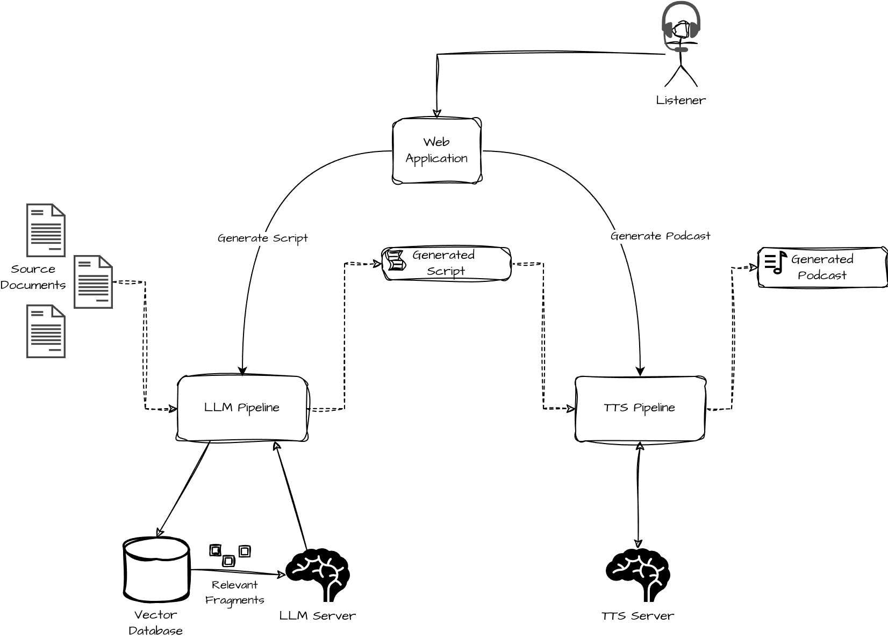
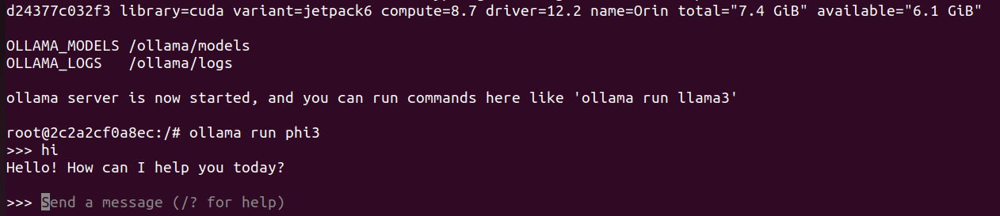
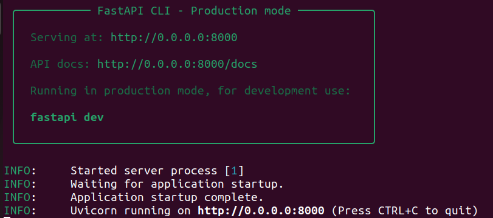

# Blog Post

Date: 09/16/24 by Dima Kniazev

## Intro

I came across these documents that have been sitting on my home NAS appliance for a very, very long time. Obviously, I was not going to read them or, even open any of them: like every other parent in the world I had other things to do: pick up my kids from school, drive them home for a quick snack, drop them off for swimming classes, then drive to here, there and the rest of the universe... I drive a lot and like listening to the podcasts while driving. Hey, smart AI! - I thought, are you actually that smart to turn these documents into a podcast for me?

A few days after I joined a hackathon, because, you know, nothing motivates me better than a deadline. I wanted to learn more about Gen AI and the ecosystem for building these apps.

## Architecture

I broke down the problem into two steps: **generating a script** and **generating a podcast**. I decided to use a simple UI where the listener (me) would specify their interests and first see the script generated by an LLM (Large Language Model). If it wasn't good enough, was too big, or too small, I could then re-run that step or edit it manually before feeding it into the next step. Generating a podcast is the second step which would involve running a TTS (Text-to-Speech) model to produce a human-like audio that I can download and listen to on the go.



A simple [RAG](https://blogs.nvidia.com/blog/what-is-retrieval-augmented-generation/) architecture came to my mind. Usually, it is used to augment LLM with private data, but in my case, while the data was public, I still wanted to select the fragments tailored to my current interests. For example, I had a bunch of documents that looked like weekly news about Python, Rust, and Java. And if I wanted to learn about Web frameworks (regardless of the language) I expected the system to only get the relevant fragments to be used for the script generation.

I decided to use [LangChain](https://www.langchain.com/) framework to implement the LLM pipeline which provides support for a variety of vector databases and models. My LLM server is a separate [Ollama](https://ollama.com/) container which I can use to serve and switch between the different models to test their performance. The TTS pipeline uses a simple API which is exposed in the TTS server using the [Fastapi](https://fastapi.tiangolo.com/) framework. TTS server also runs in a separate container serving the [Suno AI Bark](https://github.com/suno-ai/bark) text-to-speech model served using the [HuggingFace's transformers](https://huggingface.co/docs/transformers/en/index) library. Finally, the UI is implemented as a dead simple [Gradio](https://www.gradio.app/) app.

## Implementation

I typically use VS Code to develop my applications. For this hackathon organizers suggested using [NVIDIA AI Workbench](https://www.nvidia.com/en-us/deep-learning-ai/solutions/data-science/workbench/) which I explored in every detail. If you are an applications developer, like me, this tool is not a replacement for your IDE. But it will help you orchestrate your AI solution, test it locally on your machine, and then reproduce your environment on a different GPU-enabled system. Most apps are packaged and delivered as container images today and the thing is, running a GPU-enabled app can be complex: from GPU drivers to container runtime, to CUDA version, to ML framework (such as PyTorch or TensorFlow), not to even mention your app dependencies. All these things are handled by the tool so you have more time to focus on your application implementation.

AI Workbench is installed on your dev machine and then used to connect to a GPU-enabled location, which, if you are lucky, can be your local dev machine. You can then create a new project or clone an existing one from GitHub. AI workbench will guide you to select the base image (for beginners, I highly recommend sticking to one of NVIDIA's Python + CUDA images) and will create a project skeleton for you. When you build your project, it creates a docker image and installs all the dependencies into it. You can use **apt** and **pip** package managers to define tools and libraries needed for your project. I wish NVIDIA supported **uv** as an option since pip installs are probably the slowest part of the building process. Each container can host multiple components (aka apps) for your solution. For example, you can have a [Fastapi](https://fastapi.tiangolo.com/) server exposing the API of your LLM and a [Gradio](https://www.gradio.app/) frontend utilizing that model through an exposed API. These will be your two apps packaged to the same project container and can be started/stopped individually.

AI Workbench can be used to orchestrate and package any AI projects, however, it will really shine if you are developing for NVIDIA GPU-enabled system. It will save you a lot of time by guiding you through the process and automating things like installing the drivers, configuring the container runtime, building and running your dockerized projects and even capturing logs. The only thing to keep in mind is that you have to have access to a supported GPU system, such as **RTX** or **H100**. Unfortunately, I didn't have that in my pocket, so I tried testing it on a cheaper **Jetson Orin Nano** which at the time of writing this article is not yet supported. I hope NVIDIA adds support for the arm64-based Jetsons since developing embedded AI solutions looks like a great use of the tool to me.

Overall, I think, AI Workbench accelerates the development and testing of your AI solution and should be particularly useful for enterprises, where having a ready-to-deploy container bundled with all the dependencies reduces the time to deployment dramatically.

## Test It Out

> Note: I have tested my project on `Ubuntu 22` + `Jetson Orin Nano`. Let me know if it works on other platforms :)

Before testing the `cast-ai-workbench` project I recommend installing and verifying a few things:

1. [Docker Desktop](https://docs.docker.com/desktop/install/linux/ubuntu/) - this will ensure you have the Docker environment working on your machine. In my case I had to install and configure Docker on both, my Ubuntu laptop and Jetson Orin Nano computers. A great resource for that is [SSD+Docker](https://www.jetson-ai-lab.com/tips_ssd-docker.html) by [NVIDIA Jetson AI Lab](https://www.jetson-ai-lab.com/index.html).

2. [AI Workbench](https://www.nvidia.com/en-us/deep-learning-ai/solutions/data-science/workbench/) - this will be the main tool to configure, build and run the project. It requires the Docker (or Podman) to be installed in your system.

I also use [VS Code](https://code.visualstudio.com/docs/setup/linux) as my main IDE, but it is not needed unless you want to modify and change the code.

> Now, this is important! Since I don't have a GPU on my Ubuntu machine, I decided to fiddle with the [docker contexts](https://docs.docker.com/reference/cli/docker/context/) so I'm able to build and run my LLM and TTS server images on my Jetson machine. Follow the steps below to learn how to do that. In case, you do have a GPU and enough memory to run it on your dev machine, you will need to modify the [build and run scripts](code/scripts/build.sh) to remove the `remote` context from there.

### Add Remote Docker Context

1. First, you need to configure passwordless access to your Jetson machine. The easiest way of doing it is to [configure SSH key-based authentication](https://www.digitalocean.com/community/tutorials/how-to-configure-ssh-key-based-authentication-on-a-linux-server).

You need to generate your `SSH` key (you may already have one, so skip this step if you know it already exists)

```sh
ssh-keygen
```

Then, copy your public key to a remote Jetson machine (replace username and host with your values):

```sh
ssh-copy-id dzimka@jetson-nano
```

Now you should be able to ssh to your host without a password:

```sh
$ ssh dzimka@jetson-nano
Welcome to Ubuntu 22.04.5 LTS (GNU/Linux 5.15.136-tegra aarch64)
...
```

2. The second step is to create a docker context and verify it is working properly.

Check your existing contexts (the `*` next to a name indicates the active context):

```sh
$ docker context ls
NAME              DESCRIPTION                               DOCKER ENDPOINT                                   ERROR
default           Current DOCKER_HOST based configuration   unix:///var/run/docker.sock
desktop-linux *   Docker Desktop                            unix:///home/dzimka/.docker/desktop/docker.sock
```

Add the new context (you can name it differently, but make sure you modify the [scripts](code/scripts/) accordingly as I have hardcoded it in there...)

```sh
docker context create remote --docker "host=ssh://dzimka@jetson-nano"
```

Finally, verify the `remote` context is accessible:

```sh
docker --context remote info
```

This should display your Jetson docker information.

> Note:

### Clone and Build Workbench Project

Open AI Workbench and connect to your local location. You should see the `My Projects | local` screen where you may choose to create a new one or clone an existing one. Choose `Clone Project` and put the project GitHub link (if you are planning to change the code, then I suggest forking the project first):

```
https://github.com/dzimka/cast-ai-workbench.git
```

Optionally, change the location of the project on your machine:


After cloning the project it will open the project window and will mark it with the `Build Required` tag. Hit the `Start Build` button and return to this guide as we will continue working on the other stuff while the building process runs.

> Note: Building the AI Workbench project will take a while (about 10-15 minutes on my machine). During this time the tool will download the base image, install all the project dependencies, and prepare the new `project` image.

In the meantime, we can work on the Jetson images.

> Note: In theory, this part could have been automated and included in the workbench project, similarly, how the [workbench-example-hybrid-rag](https://github.com/NVIDIA/workbench-example-hybrid-rag) application does that. In practice though, this sort of orchestration is actually a limitation of my chosen deployment environment (Ubuntu dev machine + Jetson machine) and would not be needed at all if I had a proper development system on a single laptop. So I decided to skip this part and focus on what is really interesting - using the models.

In your terminal, navigate to the [scripts](code/scripts/) folder and run the `build.sh` script:

```sh
$ cd code/scripts/
$ ./build.sh
```

This will build and install images to your remote docker environment. Check the images using the command below:

```sh
$ docker --context remote images
```

You should be able to see both `tts-server` and `llm-server` images built and ready in the output. Next, let's run the `llm-server` using the `run_llm.sh` script in the same directory:

```sh
$ ./run_llm.sh
```

This will take you to the `llm-server` prompt that has the Ollama server running. You can choose any model supported by the Ollama server to be your LLM for the **script generation** task. Just keep in mind that you'll need to adjust the settings for the workbench app accordingly (we will explore it later in this guide). For now, let's download the `phi3` model. Enter in the `llm-server` prompt the commands to download and test your model:

```sh
ollama run phi3
```



Keep this running and open another terminal to start the `tts-server`:

```sh
$ ./run_tts.sh
```



### Running the App

Now, that we have everything ready on the Jetson machine, let's go back to the AI Workbench and see if the build process has finished. If you see the `Build Ready` message at the bottom of the screen, we should be good to go. One last thing we need to do is to modify the environment variables. Go to the `Environment` tab and scroll down to the `Variables` section:


Modify the environment variables so that they point to your Jetson machine - figure out the IP address and edit the variables for the LLM and TTS server. Here, you can also change the LLM model that you want to use for **script generation** (make sure you download it with the Ollama server before using it).

That's it! Hit the `Open Gradio-app` button and wait till the workbench starts your environment and navigates you to the application. When you see this screen below you can start experimenting with the app:


First, you generate the script. Specify the topics of interest (you can put whatever you want in there, but the LLM is instructed to only use the documents in the [/data/docs](data/docs/) directory for the script generation task). Click on the `Generate Script` button and wait till it finishes. The output will be in the `Generated script` textbox. Review and modify it however you like it before feeding it to the next step. For experimentation, I suggest keeping it small, maybe even down to one or two sentences, because the TTS model is not able to generate audio longer than a few seconds for a single request (something that can definitely be improved later).

Next, click on the `Generate Podcast` button to call the TTS model and pass the script as an input parameter to it. This step takes about 90 seconds on my Jetson Orin Nano, so please be patient if you run it in a similar setup. Once the audio is generated you can simply use the audio component play button to play it.

Congrats! You've now used not one, but two GenAI models in a single app built with NVIDIA AI Workbench! Thanks for reading.

P.S. I suggest you look into the code itself, and play with the various LLM models (such as `llama3` and `mistral` - believe me, this was a lot of fun!) and also voices in the TTS model. Also, please let me know how this app can be improved or feel to send your PRs!
